# Mental Health Stress Prediction Using ML
### A From-Scratch Implementation in Java

> **SPL1 Project — Institute of Information Technology (IIT), University of Dhaka**
>  | **Student:** Sadman Sakib | **Exam Roll:** 245406
>  | **Supervisor:** Dr. Emon Kumar Dey | **Presentation:** SPL1 Final, 2025

---

## Table of Contents

- [Project Overview](#Project-Overview)
- [Dataset](#Dataset)
- [Feature Selection](#Feature-Selection)
- [Dataset Challenge: Class Imbalance](#Dataset-Challenge:-Class-Imbalance)
- [Project Structure](#Project-Structure)
- [Model Implementation](#Model-Implementation)
- [Evaluation Methodology](#Evaluation-Methodology)
- [Preprocessing: Normalization & Balancing](#Preprocessing-Normalization-Balancing)
- [Hyperparameter Tuning](#-hyperparameter-tuning)
- [Final Results](#-final-results)
- [How to Run](#-how-to-run)
- [Technologies Used](#-technologies-used)

---

## Project Overview

**Project Goal:**
Develop a machine learning system to predict student stress levels **(Low, Moderate, High)** using demographic and psychological data.

| Highlight | Detail |
|---|---|
| **Dataset** | A survey-based dataset (MHP Dataset) of 2,028 Bangladeshi university students across 15 institutions |
| **Approach** | From-scratch implementation in Java (no ML libraries) |
| **Models** | Decision Tree, Logistic Regression, K-Nearest Neighbors |
| **Methodology** | 10-Fold Cross-Validation with iterative optimization |
| **Best Performance** | 72.8% recall for Low stress, 78.9% for High stress (Act 3) |

---

## Dataset

**Source:** [MHP (Anxiety, Stress, Depression) Dataset — figshare](https://figshare.com/articles/dataset/MHP_Anxiety_Stress_Depression_Dataset_of_University_Students/25771164)

The dataset contains responses from **2,028 Bangladeshi university students** across **15 institutions**.

### Feature Categories

| Category | Features |
|---|---|
| **Demographic** | Age, Gender, Academic Year |
| **Academic** | Current CGPA, Waiver/Scholarship, University, Department |
| **Psychological** | Anxiety Value (GAD-7, 0–21), Depression Value (PHQ-9, 0–27) |
| **Target** | **Stress Label** — Low (0–13), Moderate (14–26), High (27–40) |

---

## Feature Selection

Feature selection was performed in two stages: **Pearson Correlation** for continuous features and **Group Distribution Analysis** for categorical features.

---

### 1.Pearson Correlation Analysis

> Pearson Correlation quantifies linear relationship strength between features and stress (-1 to +1). Applied to continuous/numerical features only: **Age, CGPA, Anxiety Value, Depression Value.**

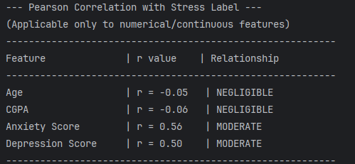

| Feature | r value | Relationship | Decision |
|---|---|---|---|
| Age | -0.05 | NEGLIGIBLE | Further Analysis Needed |
| CGPA | -0.06 | NEGLIGIBLE | Further Analysis Needed |
| Anxiety Score | **0.56** | MODERATE | ✅ Keep — clear linear trend |
| Depression Score | **0.50** | MODERATE | ✅ Keep — clear linear trend |

**Anxiety Score and Depression Score** show clear linear trends with the stress label — strongest predictors in the dataset.

---

### 2. Feature Analysis: Age & CGPA

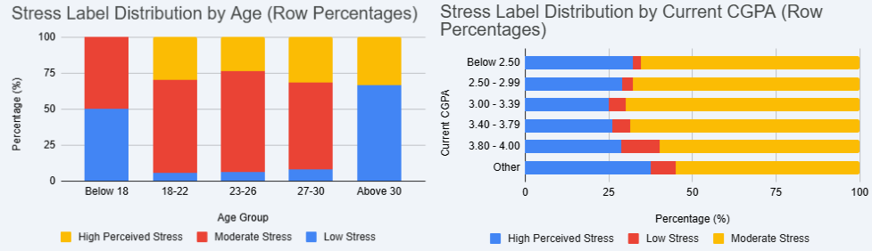

**Age:**
- "Below 18" has ~50% Low Stress — unusually high
- "18–22" Low Stress almost disappears
- "Above 30" Low Stress shoots back up again
- ✅ **Keep Age** — U-shaped / non-linear pattern

**CGPA:**
- Across ALL CGPA ranges, the distribution looks nearly identical — dominated by Moderate Stress with similar High/Low ratios
- ✅ **Keep CGPA** — Domain Relevance

---

### 3. Group Distribution Analysis

Applied to categorical features: **Gender, Waiver/Scholarship, Academic Year**

#### Gender Distribution

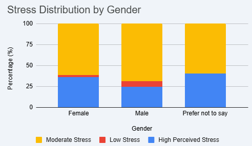

| Group | N | Low Stress | Moderate Stress | High Perceived Stress |
|---|---|---|---|---|
| Female | 613 | 15 (2.4%) | 377 (61.5%) | 221 (36.1%) |
| Male | 1405 | 100 (7.1%) | 965 (68.7%) | 340 (24.2%) |
| Prefer not to say | 10 | 0 (0.0%) | 6 (60.0%) | 4 (40.0%) |

- Females: **36.1% High Stress** — noticeably higher
- Males: **24.2% High Stress** — lower
- The gap is **~12 percentage points**, which is meaningful
- ✅ **Keep Gender** — meaningful distributional differences across groups

---

#### Academic Year & Waiver Distribution

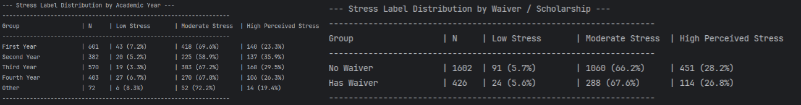

| Group | N | Low Stress | Moderate Stress | High Perceived Stress |
|---|---|---|---|---|
| First Year | 601 | 43 (7.2%) | 418 (69.6%) | 140 (23.3%) |
| Second Year | 382 | 20 (5.2%) | 225 (58.9%) | 137 (35.9%) |
| Third Year | 570 | 19 (3.3%) | 383 (67.2%) | 168 (29.5%) |
| Fourth Year | 403 | 27 (6.7%) | 270 (67.0%) | 106 (26.3%) |
| Other | 72 | 6 (8.3%) | 52 (72.2%) | 14 (19.4%) |

**Excluded Academic Year** — Non-linear spike in 2nd year, but weak discriminative power overall.

| Group | N | Low Stress | Moderate Stress | High Perceived Stress |
|---|---|---|---|---|
| No Waiver | 1602 | 91 (5.7%) | 1060 (66.2%) | 451 (28.2%) |
| Has Waiver | 426 | 24 (5.6%) | 288 (67.6%) | 114 (26.8%) |

**Excluded Waiver** — Almost no discriminative power between groups.

> University and Department excluded to avoid **institutional bias** and maintain generalizability.

---

### Final Selected Features (5)

```
Age  •  Gender  •  CGPA  •  Anxiety Value  •  Depression Value
```

---

## Dataset Challenge: Class Imbalance

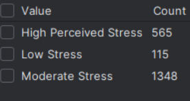

| Class | Count | Percentage |
|---|---|---|
| Moderate Stress | 1,348 | 66.5% |
| High Perceived Stress | 565 | 27.9% |
| **Low Stress** | **115** | **5.7%** |

**Impact on Model Performance:**
- Models biased toward Moderate class
- Poor recall for Low and High stress
- Misses critical at-risk students

This imbalance is directly addressed in **Act 2** using oversampling.

---

## Project Structure

```
Mental-Health-Stress-Prediction-Using-ML/
│
├── src/
│   ├── Main.java                            # Entry point — 3-option interactive menu
│   │
│   ├── data/
│   │   ├── DataLoader.java                  # CSV parsing & feature encoding
│   │   ├── DataPoint.java                   # Data model (features + label + metadata)
│   │   └── Preprocessor.java               # Normalization, oversampling, K-Fold split
│   │
│   ├── models/
│   │   ├── logisticRegression/
│   │   │   └── LogisticRegression.java      # Softmax + SGD from scratch
│   │   ├── knn/
│   │   │   └── KNN.java                     # K-Nearest Neighbors from scratch
│   │   └── decisionTree/
│   │       ├── DecisionTree.java            # Gini impurity + recursive split
│   │       ├── Node.java                    # Tree node structure
│   │       ├── BestSplitResult.java         # Stores best split candidate
│   │       └── SplitCondition.java          # Split condition definition
│   │
│   └── evaluation/
│       └── ConfusionMatrix.java             # Accuracy, Precision, Recall, F1
│
├── MentalHealth.csv                         # Dataset (place in root directory)
├── images/                                  # All charts and screenshots
└── README.md
```

---

## Model Implementation

All three models are implemented **entirely from scratch in Java** — no external ML libraries used.

| Model | Key Details | Why Chosen |
|---|---|---|
| **Decision Tree** | Gini Impurity, Initial: maxDepth=10, Optimized: maxDepth=5 | Handles non-linear patterns (e.g. Age) without normalization |
| **Logistic Regression** | Softmax + SGD, Epochs=500, LR=0.01 | Widely used in health classification; reveals critical impact of normalization |
| **KNN** | Euclidean distance, Initial: k=5, Optimized: k=21 | Mental health screening is naturally a peer-comparison problem |

---

## Evaluation Methodology

### 10-Fold Cross-Validation

Data is split into 10 folds; each fold serves as the test set once while the remaining 9 folds train the model. This ensures **every data point is used for both training and testing**.

### Iterative Pipeline (3 Acts)

```
Raw Data
   │
   ▼
ACT 1: Imbalanced (Baseline)
   │  → High accuracy but poor minority class recall
   ▼
ACT 2: Balanced + Normalized
   │  → Min-Max normalization + Oversampling
   │  → Dramatically improves Low & High stress recall
   ▼
ACT 3: Optimized
   |  → Tuned hyperparameters (maxDepth=5, k=21)
   |  → Best overall minority class performance
```

### Act 1: Imbalanced Baseline

**Act 1 Low Stress Recall**

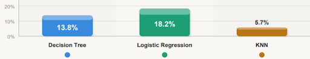

**Act 1 High Stress Recall**

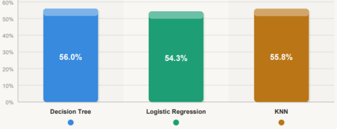

**Observation:** High accuracy but critically poor minority recall — models heavily biased toward Moderate Stress class due to imbalance.

| Model | Low Stress Recall | High Stress Recall |
|---|---|---|
| Decision Tree | 13.8% | 56.0% |
| Logistic Regression | 18.2% | 54.3% |
| KNN | 5.7% | 55.8% |

---

## Preprocessing: Normalization & Balancing

### Act 2: Min-Max Normalization + Oversampling

- **Normalization:** Scales all features to [0,1] range — prevents large-scale features from dominating distance-based models (KNN, LR)
- **Oversampling:** Duplicates minority class samples (Low, High stress) to match majority class (Moderate), eliminating bias toward dominant class

**Act 2 Low Stress Recall**&emsp;&emsp;&emsp;&emsp;&emsp;&emsp;&emsp;&emsp;&emsp;&emsp;&emsp;&emsp;&emsp;&emsp;&emsp;&emsp;&emsp;&emsp;&emsp;&emsp;&emsp;&emsp;&emsp;**Act 2 High Stress Recall**
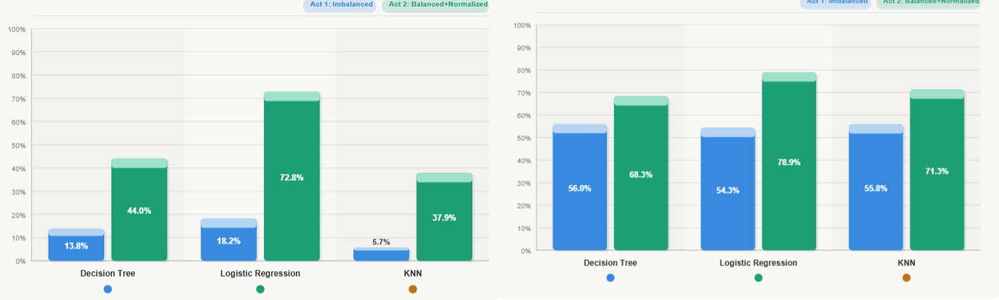


> **Observation:** Balancing + normalization dramatically boosts Low-stress recall (up to **+54 percentage points for LR**) and moderately improves High-stress recall across all models.

| Model | Low Recall (Act 1 → Act 2) | High Recall (Act 1 → Act 2) |
|---|---|---|
| Decision Tree | 13.8% → 44.0% | 56.0% → 68.3% |
| Logistic Regression | 18.2% → **72.8%** | 54.3% → **78.9%** |
| KNN | 5.7% → 37.9% | 55.8% → 71.3% |

---

## Hyperparameter Tuning

Grid search performed on the **Act 2 pipeline** (balanced + normalized) to find optimal parameters that maximize minority class recall.

### KNN — k Parameter Tuning

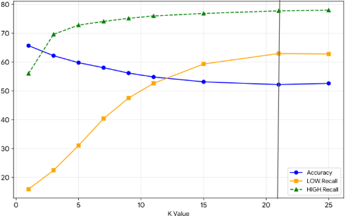

**Chosen k = 21** — LOW recall plateaus and HIGH recall is maximized without accuracy collapsing.

### Decision Tree — maxDepth Tuning

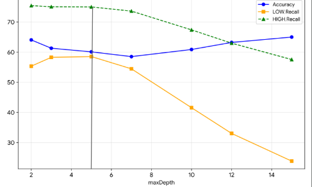

**Chosen maxDepth = 5** — LOW recall stays balanced while HIGH recall remains strong before both degrade at deeper depths.

> **Logistic Regression:** No hyperparameters tuned — learning rate and epochs fixed at 0.01 and 500.

---

## Final Results

### Act 3: Optimized Models — Balanced + Normalized + Tuned Parameters (maxDepth=5, k=21)

**Act 3 Low Stress Recall**&emsp;&emsp;&emsp;&emsp;&emsp;&emsp;&emsp;&emsp;&emsp;&emsp;&emsp;&emsp;&emsp;&emsp;&emsp;&emsp;&emsp;&emsp;&emsp;&emsp;&emsp;&emsp;&emsp;**Act 3 High Stress Recall**
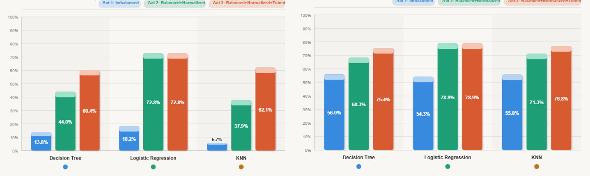

> Further tuning (Act 3) closes the gap for DT and KNN on both classes, making all three models competitive, while **LR peaks at Act 2 and gains nothing from tuning.**

### Low Stress Recall — Critical Metric for Early Detection

| Model | Act 1 | Act 2 | Act 3 |
|---|---|---|---|
| Decision Tree | 13.8% | 44.0% | **60.4%** |
| Logistic Regression | 18.2% | **72.8%** | 72.8% |
| KNN | 5.7% | 37.9% | **62.1%** |

### High Stress Recall — Essential for Risk Identification

| Model | Act 1 | Act 2 | Act 3 |
|---|---|---|---|
| Decision Tree | 56.0% | 68.3% | **75.4%** |
| Logistic Regression | 54.3% | **78.9%** | 78.9% |
| KNN | 55.8% | 71.3% | **76.8%** |

### Best Model: Logistic Regression

| Metric | Value |
|---|---|
| Low Stress Recall | **72.8%** |
| High Stress Recall | **78.9%** |
| Pipeline | Balanced + Normalized |

> In a mental health prediction context, **recall for minority classes (Low and High stress) is the critical metric** — missing a high-stress student is a far worse outcome than a false alarm.

---

## How to Run

### Prerequisites
- Java JDK 8 or higher
- IntelliJ IDEA (recommended) or any Java IDE
- `MentalHealth.csv` placed in the **root/working directory**

### Steps

**1. Clone the repository**
```bash
git clone https://github.com/itsAkhar/Mental-Health-Stress-Prediction-Using-ML.git
cd Mental-Health-Stress-Prediction-Using-ML
```

**2. Open in IntelliJ IDEA**
```
File → Open → Select project folder
Right-click src/ → Mark Directory as → Sources Root
```

**3. Place the dataset**
```
MentalHealth.csv  ←  place in root directory (same level as src/)
```

**4. Run Main.java**
```
Right-click Main.java → Run 'Main.main()'
```

**5. Use the interactive menu**
```
==========================================================
     Mental Health Stress Prediction System - IIT, DU
==========================================================

----------------------------------------------------------
Please select an option:
  1 -> Feature Analysis
  2 -> Model Evaluation (10-Fold CV)
  3 -> Predict Stress for a New Student
  0 -> Exit
Your choice:
```

### Menu Options

| Option | Description |
|---|---|
| `1` | **Feature Analysis** — Pearson correlation for continuous features + group distribution tables for categorical features |
| `2` | **Model Evaluation** — Runs full 10-Fold CV across all 3 Acts and prints confusion matrix, accuracy, precision, recall, F1 |
| `3` | **Predict** — Enter a new student's data and get individual predictions from all 3 models + majority vote result |
| `0` | Exit |

### Option 3 — Sample Prediction Output
```
==========================================================
                  PREDICTION RESULTS
==========================================================
  Decision Tree predicts            : Moderate Stress
  Logistic Regression predicts      : High Perceived Stress
  KNN (k=21) predicts               : High Perceived Stress
----------------------------------------------------------
  >>> FINAL PREDICTION (Majority Vote) : High Perceived Stress  (2/3 votes)
==========================================================
```

### Changing Number of Repeats
In `Main.java`, change the constant manually:
```java
private static final int NUM_REPEATS = 1;   // Change to 50 for full statistical analysis
```

---

## Technologies Used

| Tool | Purpose |
|---|---|
| **Java** | Primary programming language |
| **IntelliJ IDEA** | Development environment |
| **Git & GitHub** | Version control and project tracking |
| **CSV** | Dataset input format |
| **Manual Math** | All ML algorithms implemented from scratch (no libraries) |

---

## Acknowledgements

- **Dataset:** MHP (Anxiety, Stress, Depression) Dataset — figshare
- **Supervisor:** Dr. Emon Kumar Dey, IIT, University of Dhaka
- **Institution:** Institute of Information Technology (IIT), University of Dhaka

---

*SPL1 Final Project — 2025*
